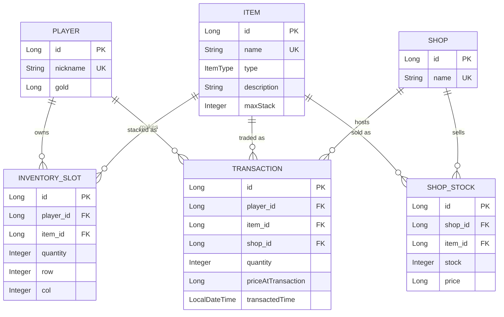

# game-shop

Spring Boot로 만든 게임 상점 도메인 REST API. 플레이어가 상점에서 아이템을 사고, 인벤토리에 쌓고, 거래 기록이 남는 기본적인 흐름을 구현한 토이 프로젝트입니다.

개발 과정과 문제/해결 기록은 [study.md](study.md) 참고.

## 기술 스택

- Java 21, Spring Boot 4.1
- Spring Data JPA, H2 (in-memory)
- Bean Validation (Jakarta Validation)
- springdoc-openapi (Swagger UI)
- Lombok
- JUnit5 + AssertJ

## 실행 방법

```bash
./gradlew bootRun
```

기본 포트는 `9000`이고, 뜨자마자 기본 시드 데이터(플레이어 1명, 아이템 3종, 상점 1개+재고)가 자동으로 채워집니다 ([`DataInitializer`](src/main/java/com/toy/game_shop/config/DataInitializer.java)).

- 데모 웹 페이지: http://localhost:9000/ (`feature/demo-web` 브랜치에만 있음)
- Swagger UI: http://localhost:9000/swagger-ui.html

## 도메인 구조



- **Player**: 닉네임, 골드 보유
- **Item**: 아이템 정의(이름/타입/최대 스택 수)
- **InventorySlot**: 플레이어가 실제로 들고 있는 아이템 슬롯 (수량, 6x10 그리드 상 위치)
- **Shop / ShopStock**: 상점과 그 상점이 파는 아이템의 재고/가격
- **Transaction**: 구매 기록 (누가, 어느 상점에서, 무엇을, 얼마에)

## 기능

**Player**
- 생성/전체 조회/id 조회/닉네임 조회/patch 수정/삭제
- 골드 미입력 시 0으로 처리, 구매 시 골드 차감(부족하면 거부)

**Item**
- 생성/전체 조회/id 조회/이름 조회/타입별 조회/patch 수정/삭제
- 타입 미지정 시 `NONE`, `maxStack` 미지정 시 `99`로 기본값 처리

**Shop / ShopStock**
- 상점 생성/전체 조회/id·이름 조회/patch 수정/삭제
- 상점 상세 조회 시 그 상점이 파는 재고 목록까지 한 번에 포함
- 상점별 재고 등록/조회/patch 수정/삭제, 재고 증가·감소
- 모든 재고 조작에 `shopId` 기반 소유권 검증 (다른 상점 재고는 조작 불가)

**Inventory**
- 플레이어별 전체 슬롯 조회 (player 정보는 최상단에 한 번만, 슬롯마다 item/quantity/position)
- 아이템 수량 증가/감소 — 슬롯 하나가 아이템별 `maxStack`을 넘으면 자동으로 다음 슬롯에 나눠 담음
- 슬롯 합치기(merge) — 같은 아이템끼리만, `maxStack` 넘는 만큼은 원래 슬롯에 남김
- 슬롯 분할(split) — 지정한 수량만큼 새 슬롯으로 분리
- 슬롯 위치 이동 — 6x10 그리드에서 빈 칸 자동 배치, 이미 다른 슬롯이 있는 칸으로는 이동 불가
- 슬롯 삭제, 아이템 단위 일괄 삭제

**Purchase**
- 골드 차감 + 재고 차감 + 인벤토리 반영 + 거래 기록 생성을 하나의 트랜잭션으로 처리 (중간에 실패하면 전부 롤백)

**Transaction**
- 거래 내역 조회 — 전체 / 단건(id) / 플레이어별 / 아이템별 / 플레이어+아이템별

**공통**
- 전역 예외 처리: 조회 실패(404), 잘못된 값(400), 처리 불가한 상태(409), 요청/DB 제약 위반(400/409)을 각각 알맞은 상태 코드로 응답
- 요청 DTO Bean Validation — Create는 필수값 강제, Patch는 값이 있을 때만 검증(필드 생략 = 그대로 유지)
- N+1 방지를 위한 fetch join 적용 (다대일/일대다 모두)
- 앱 시작 시 기본 시드 데이터 자동 삽입 (`prod` 프로필에서는 비활성)

## API 개요

| 리소스 | Base path | 주요 기능 |
|---|---|---|
| Player | `/players` | CRUD, 닉네임 조회 |
| Item | `/items` | CRUD, 이름/타입 조회 |
| Shop | `/shops` | CRUD, 상세 조회(재고 목록 포함) |
| ShopStock | `/shops/{shopId}/stock` | 재고 CRUD, 증감 |
| Inventory | `/players/{playerId}/inventory` | 슬롯 조회, 수량 증감, 병합/분할/위치 이동 |
| Purchase | `/players/{playerId}/purchase` | 구매 (골드 차감 + 재고 차감 + 인벤토리 반영 + 거래 기록을 한 트랜잭션으로 처리) |
| Transaction | `/transactions` | 거래 내역 조회 (전체/플레이어별/아이템별) |

전체 스펙은 실행 후 Swagger UI에서 확인하는 게 가장 정확합니다.

## 테스트

```bash
./gradlew test
```

Repository/Service 레이어 위주로, 정상 케이스 + 미존재 id + 잘못된 입력(예외) 케이스를 커버합니다.
